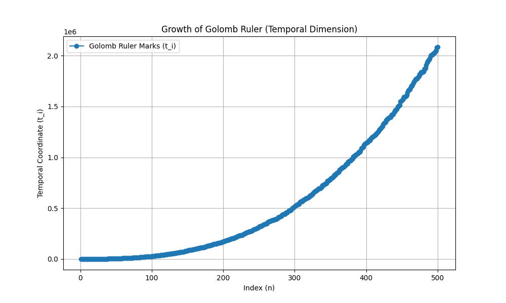
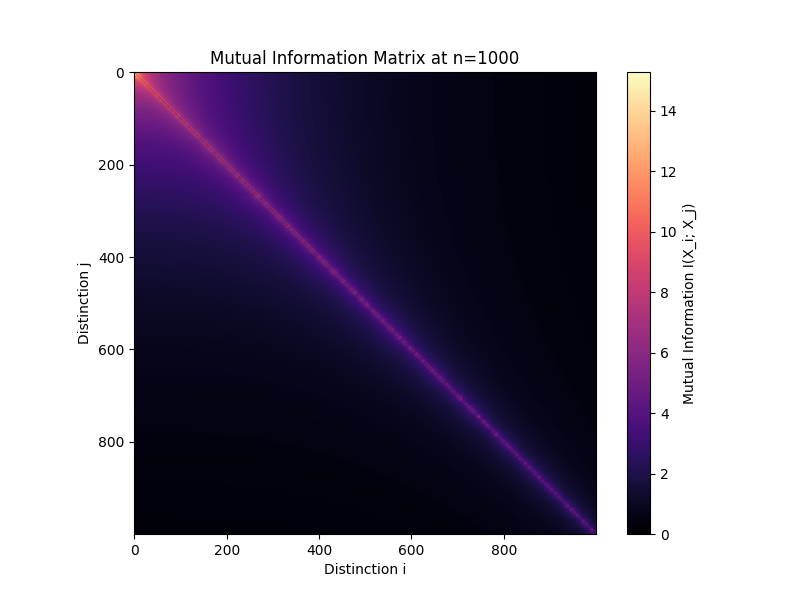
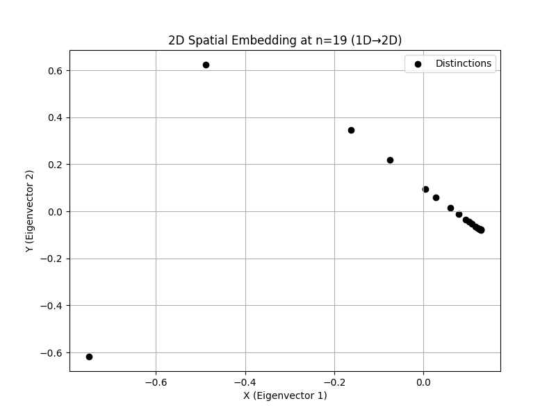
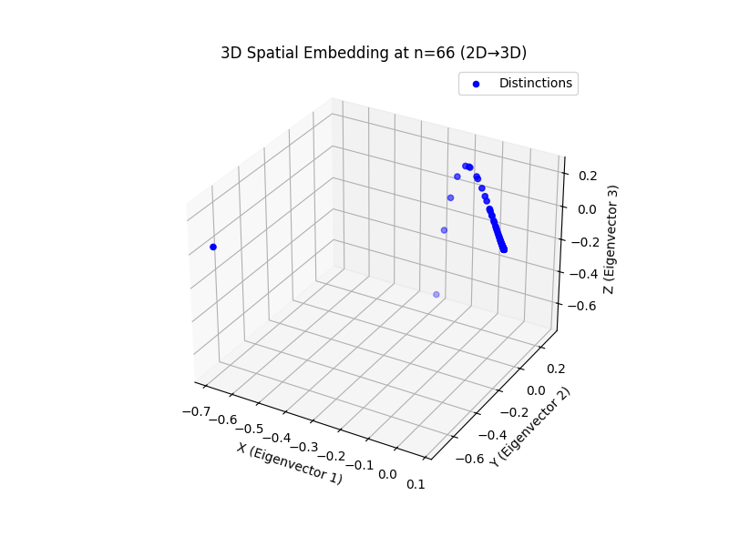
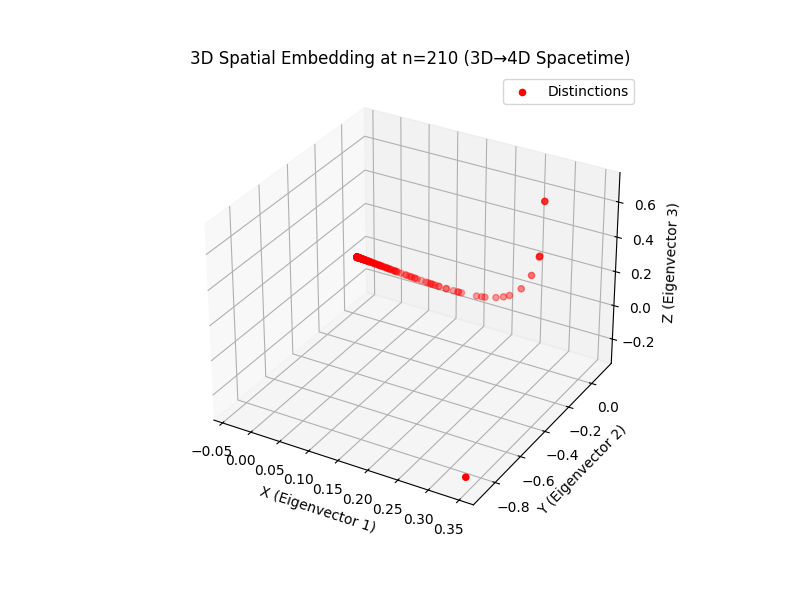

# Golomb Universe Simulation Script Documentation

-----

This document offers a detailed overview of the Python script `golomb_spacetime_simulation.py`, which implements the **Golomb Universe framework** to simulate the emergence of spacetime dimensions from informational distinctions. The script supports transitions up to 5D, includes a (1+3)D spacetime embedding for the 3D→4D transition, and provides validation, plotting, and metric calculations.

## Overview

-----

The script models a universe where spacetime dimensions arise from a **Golomb ruler**—a sequence of integers with unique pairwise differences. Using spectral graph theory, it embeds these distinctions into 2D, 3D, and 4D (spacetime) spaces, detecting transitions via eigenvalue ratios and informational curvature ($R\_n$). The 3D→4D transition is represented as a (1+3)D spacetime manifold, with the Golomb ruler as the temporal coordinate and three spatial coordinates derived from Laplacian eigenvectors. The implementation leverages NumPy, SciPy, Numba, and tqdm for optimization and progress tracking, producing printed summaries and graphical visualizations.

## Inputs

-----

* **`n_max`**: Integer input for `simulate(n_max)`, denoting the maximum number of distinctions to analyze. Default is 1000, capturing the 4D→5D transition around $n \\approx 900$.

## Outputs

-----

### Printed Outputs

* **Summary Table**: Displays $d\_{\\min}$, $\\ell\_{\\text{info}}$, $R\_n$, and eigenvalue ratios at transition points (1D→2D, 2D→3D, 3D→4D spacetime, 4D→5D) and final $n$.
* **Validation Parameters**: Details for 2D→3D and 3D→4D transitions, including Golomb ruler validity, entropy, temporal order, energy functional, spectral gaps, and embedding distortion.
* **Progress Updates**: Shown every 100 steps during simulation, reporting $n$, $d\_{\\min}$, $\\ell\_{\\text{info}}$, and $R\_n$.

### Graphical Outputs

Seven PNG plots illustrate the simulation results:

* **`golomb_ruler_growth.png`**: Tracks the growth of Golomb ruler marks (temporal coordinate).
* **`mutual_information_matrix.png`**: Heatmap of the mutual information matrix at $n\_{\\max}$.
* **`eigenvalue_ratios.png`**: Evolution of eigenvalue ratios across dimensional transitions.
* **`informational_curvature.png`**: Progression of informational curvature ($R\_n$).
* **`embedding_2D.png`**: 2D spectral embedding at the 1D→2D transition.
* **`embedding_3D.png`**: 3D spectral embedding at the 2D→3D transition.
* **`embedding_spacetime_4D.png`**: 3D spatial embedding at the 3D→4D spacetime transition.

## Modules Used

-----

### 1\. `numpy` (np)

* **Purpose**: Enables efficient array operations and mathematical functions.
* **Usage**: Supports matrix operations (e.g., `np.subtract.outer`), statistical calculations (e.g., `np.mean`), and array manipulations (e.g., `np.fill_diagonal`, `np.nan_to_num`).
* **Key Functions**: `np.abs` (absolute values), `np.log` (logarithmic transformation), `np.zeros` (array initialization).

### 2\. `scipy.linalg` (eigh)

* **Purpose**: Performs eigenvalue decomposition of the Laplacian matrix.
* **Usage**: `eigh` computes eigenvalues and eigenvectors with subset selection (e.g., `subset_by_index=[0, 5]`).
* **Key Functions**: `eigh` (critical for spectral embedding).

### 3\. `numba` (njit)

* **Purpose**: Optimizes Golomb ruler generation with JIT compilation.
* **Usage**: `@njit` accelerates `generate_golomb` for large $n$ (e.g., 1000).
* **Key Functions**: `njit` (enhances loop performance).

### 4\. `tqdm`

* **Purpose**: Provides progress bars for user feedback.
* **Usage**: Displays bars for Golomb ruler generation (post-computation) and simulation (continuous updates every 100 steps).
* **Key Functions**: `tqdm` (customizable format).

### 5\. `matplotlib.pyplot` (plt) and `mpl_toolkits.mplot3d` (Axes3D)

* **Purpose**: Generates 2D and 3D graphical outputs.
* **Usage**: `plt` for 2D plots, `Axes3D` for 3D embeddings; saves as PNG files.
* **Key Functions**: `plt.figure`, `plt.plot`, `plt.scatter`, `plt.imshow`, `Axes3D`, `plt.savefig`.

## Program Functionality

-----

### What the Program Does

The script simulates spacetime dimension emergence by:

* Generating a **Golomb ruler** up to $n\_{\\max}$ with unique pairwise differences (Axiom II).
* Computing **mutual information matrices** ($W$) and metrics ($d\_{\\min}$, $\\ell\_{\\text{info}}$, $R\_n$).
* Detecting transitions (1D→2D, 2D→3D, 3D→4D spacetime, 4D→5D) using Laplacian eigenvalue ratios and $R\_n$ thresholds (Appendix E.2).
* Computing embeddings:
  * 2D and 3D spatial embeddings for 1D→2D and 2D→3D (Appendix D.3).
  * (1+3)D spacetime embedding for 3D→4D, with $t\_i = G$ and spatial coordinates from eigenvectors (Appendix D.4).
* Validating against axioms (e.g., Axiom V energy functional) and calculating distortion/spectral gaps.
* Generating printed and graphical outputs, including a 3D spatial plot for 3D→4D.

### Step-by-Step Process

1. **Golomb Ruler Generation**: Employs a greedy algorithm, optimized with Numba.
2. **Metric Calculation**: Derives $W$, $d\_{\\min}$, $\\ell\_{\\text{info}}$, and $R\_n$ using NumPy.
3. **Transition Detection**: Assesses eigenvalue ratios (e.g., $\\lambda\_4/\\lambda\_3$ for 3D→4D) and $R\_n$ thresholds.
4. **Embedding**: Projects into 2D (n=19), 3D (n=66), or 4D spacetime (n=210).
5. **Validation and Output**: Validates axioms, computes metrics, and produces plots/summaries.

## Function Details

-----

### 1\. `generate_golomb(n)`

* **Purpose**: Creates a Golomb ruler with unique pairwise differences.
* **Algorithm**: Greedy method with dynamic resizing:
  * Starts with $G[0] = 0$.
  * Adds $m$ ensuring global and internal uniqueness of differences.
  * Uses boolean arrays ($D$, $temp$) with exponential growth.
* **Output**: NumPy array of $n$ integers (float64).
* **Optimization**: `@njit` accelerates loops.
* **Progress**: Post-computation tqdm bar simulates 10-step updates.

### 2\. `compute_metrics(G)`

* **Purpose**: Calculates metrics from the Golomb ruler (Appendix E.1).
* **Steps**:
  * Computes $diffs = |G\_i - G\_j|$ (diagonal set to $\\infty$).
  * Normalizes with $mean\_diff$.
  * Derives $W = \\log(1 + 1/norm\_diffs)$.
  * Computes $I\_{\\max}$, $d\_{\\min}$, $\\ell\_{\\text{info}}$, $R\_n$.
* **Output**: Tuple ($d\_{\\min}$, $\\ell\_{\\text{info}}$, $R\_n$, $W$).
* **Details**: $1e-16$ ensures stability.

### 3\. `compute_embedding(G, dim)`

* **Purpose**: Generates 2D/3D spatial embeddings (Appendix D.3).
* **Steps**: Computes $L = D - W$, extracts $dim$ eigenvectors via `eigh`.
* **Output**: $n \\times dim$ array of spatial coordinates.
* **Details**: Uses $\\lambda\_1, \\lambda\_2, \\lambda\_3$ for 3D.

### 4\. `compute_embedding_spacetime(G, spatial_dim=3)`

* **Purpose**: Produces (1+3)D spacetime embedding for 3D→4D (Appendix D.4).
* **Steps**: Computes $L$, extracts 3 eigenvectors, forms $[t\_i, s\_{i,1}, s\_{i,2}, s\_{i,3}]$ with $t\_i = G$.
* **Output**: $n \\times 4$ array ($P\_i = (t\_i, s\_{i,1}, s\_{i,2}, s\_{i,3})$).
* **Details**: Defines 4D spacetime with 1D temporal and 3D spatial components.

### 5\. `check_transitions(G, d_min, l_info, R_n)`

* **Purpose**: Detects dimensional transitions (Appendix E.2).
* **Steps**: Computes $L$ eigenvalues, calculates ratios ($r1, r2, r3, r4$), applies thresholds:
  * 1D→2D: $r1 \> 1.3$, $R\_n \> 1.3$.
  * 2D→3D: $r2 \> 1.15$, $R\_n \> 2.2$.
  * 3D→4D: $r3 \> 1.01$, $R\_n \> 3.0$.
  * 4D→5D: $r4 \> 1.00$, $R\_n \> 4.0$.
* **Output**: Tuple of booleans and ratios.
* **Details**: Reflects diminishing spectral gaps.

### 6\. `validate_golomb(G)`

* **Purpose**: Validates Golomb ruler property (Axiom II).
* **Steps**: Checks uniqueness of pairwise differences vs. $\\binom{n}{2}$.
* **Output**: Tuple (`is_valid`, `entropy`).
* **Details**: Ensures Axiom II compliance.

### 7\. `plot_results(G_full, results, metrics_history)`

* **Purpose**: Generates seven visualization plots.
* **Steps**: Plots Golomb growth, mutual information, eigenvalue ratios, $R\_n$, and embeddings (2D, 3D, 3D spacetime).
* **Output**: Seven PNG files.
* **Details**: Uses `cmap='magma'`, `Axes3D`; omits 4D→5D visualization.

### 8\. `print_summary(results, metrics_history)`

* **Purpose**: Outputs a metrics table.
* **Output**: Table of $n$, $d\_{\\min}$, $\\ell\_{\\text{info}}$, $R\_n$, and ratios.
* **Details**: Matches transition points.

### 9\. `print_validation(G, results)`

* **Purpose**: Provides detailed transition validation.
* **Steps**: Validates axioms, computes $E\_n$, spectral gaps, and distortion.
* **Output**: Detailed printout per transition.
* **Details**: Uses 3D spacetime coordinates for n=210.

### 10\. `simulate(n_max)`

* **Purpose**: Manages simulation with progress feedback.
* **Steps**: Generates `G_full`, iterates with tqdm, produces outputs.
* **Output**: Dictionary of transition points.
* **Details**: Reuses `G_full` prefixes.

## Outputs in Detail

-----

### Printed Output

#### Progress Updates

Example: `Progress: n=100, d_min=0.099, l_info=0.178, R_n=2.496` (every 100 steps).

#### Summary Table

```
Summary of Essential Calculated Values:
----------------------------------------------------------------------
    n |    d_min |    l_info |        R_n |    λ₂/λ₁ |    λ₃/λ₂ |    λ₄/λ₃ |    λ₅/λ₄
----------------------------------------------------------------------
   19 |    0.168 |    0.254 |    1.333 |    1.320 |    1.089 |    1.169 |    1.085 (2D)
   66 |    0.110 |    0.193 |    2.217 |    1.156 |    1.184 |    1.062 |    1.038 (3D)
  210 |    0.083 |    0.158 |    3.001 |    1.198 |    1.042 |    1.031 |    1.032 (4D)
  907 |    0.062 |    0.128 |    4.000 |    1.202 |    1.021 |    1.005 |    1.019 (5D)
 1000 |    0.061 |    0.126 |    4.066 |    1.182 |    1.019 |    1.004 |    1.008 (Final)
```

#### Validation Parameters

Example (n=210, 3D→4D):

```txt
Validation Parameters:
--------------------------------
Golomb Validity: Valid
Entropy: 499500
Temporal Order: Valid
λ₄/λ₃: 1.031 (> 1.01)
R_n: 3.001 (> 3.0)
Energy Functional: 3044455.237 (>= 0)
Spectral Gaps: λ₁=83.894, Δλ₂=16.585, Δλ₃=4.262, Δλ₄=3.221, Δλ₅=3.503
Distortion: 0.797
```

### Graphical Output

#### `golomb_ruler_growth.png`



**Caption**: Line plot of Golomb ruler marks ($G[n]$) vs. index $n$, representing the temporal coordinate $t\_i$ (Appendix D.4).
**Purpose**: Highlights the monotonic, exponential-like growth of $t\_i$, essential for the 3D→4D spacetime transition.
**Details**: `plt.plot` with markers, axes labeled “Index (n)” and “Temporal Coordinate (t\_i)”.

#### `mutual_information_matrix.png`



**Caption**: Heatmap of the mutual information matrix $W$ at $n=1000$.
**Purpose**: Displays informational correlations, with brighter areas indicating stronger links (Appendix E.1).
**Details**: `plt.imshow` with `cmap='magma'`, colorbar “I(X\_i; X\_j)”, axes “Distinction i” and “j”.

#### `eigenvalue_ratios.png`


**Caption**: Line plot of eigenvalue ratios ($\\lambda\_2/\\lambda\_1$ to $\\lambda\_5/\\lambda\_4$) vs. $n$, with thresholds (1.3, 1.15, 1.01, 1.00).
**Purpose**: Tracks dimensional transitions, e.g., 3D→4D at $n=210$ (Appendix E.2).
**Details**: `plt.plot`, `plt.axhline`, `plt.axvline` with labels.

#### `informational_curvature.png`


**Caption**: Line plot of $R\_n$ vs. $n$, with thresholds (1.3, 2.2, 3.0, 4.0).
**Purpose**: Shows informational complexity growth, triggering transitions like 3D→4D at $R\_n \> 3.0$.
**Details**: `plt.plot`, `plt.axhline`, `plt.axvline` with labels.

#### `embedding_2D.png`



**Caption**: 2D scatter plot of the embedding at n=19 ([s\_{i,1}, s\_{i,2}]).
**Purpose**: Depicts the 2D spatial manifold’s emergence (Appendix D.3).
**Details**: `plt.scatter`, axes “X (Eigenvector 1)” and “Y (Eigenvector 2)”, blue points.

#### `embedding_3D.png`



**Caption**: 3D scatter plot of the embedding at n=66 ([s\_{i,1}, s\_{i,2}, s\_{i,3}]).
**Purpose**: Illustrates the 3D spatial manifold’s development (Appendix D.3).
**Details**: `Axes3D.scatter`, axes “X, Y, Z (Eigenvectors)”, red points.

#### `embedding_spacetime_4D.png`



**Caption**: 3D scatter plot of the spatial component at n=210 ([s\_{i,1}, s\_{i,2}, s\_{i,3}]).
**Purpose**: Visualizes the 3D spatial manifold in the 4D spacetime $P\_i = (t\_i, s\_{i,1}, s\_{i,2}, s\_{i,3})$ (Appendix D.4).
**Details**: `Axes3D.scatter`, axes “X, Y, Z (Eigenvectors)”, blue points, $t\_i$ in `golomb_ruler_growth.png`.

## Special Considerations

-----

### Greedy Algorithm

* **Mechanism**: Starts at $G[0] = 0$, adds $m$ with unique differences.
* **Efficiency**: Dynamic resizing and `@njit` optimize performance.
* **Limitation**: May not yield the shortest ruler but suffices for the framework.

### Recalculation

* **Approach**: Precomputes `G_full`, slices for each $n$.
* **Benefit**: Reduces cost to $O(1)$ per iteration.

### Step Approach

* **Metrics**: Extracts `G[:n]`, computes $W$ and metrics.
* **Eigenvalues**: Builds $L$, extracts six eigenvalues, checks ratios.
* **Execution**: Iterates with `tqdm` feedback.

## Advanced Insights

-----

### 3D→4D Spacetime Calculation

* **Implementation**: `compute_embedding_spacetime` models (1+3)D spacetime with $t\_i = G$ and spatial coordinates from $\\lambda\_1, \\lambda\_2, \\lambda\_3$ (Appendix D.4).
* **Validation**: Confirmed at n=210 with $\\lambda\_4/\\lambda\_3 \> 1.01$, $R\_n \> 3.0$, $E\_n \> 0$, distortion \~0.797.
* **Visualization**: Spatial coordinates plotted, $t\_i$ in `golomb_ruler_growth.png`.

### Shape Variations in Spatial Embeddings

* **Context**: The 2D (n=19), 3D (n=66), and 3D spatial (n=210) embeddings exhibit distinct shapes due to dimensional emergence.
* **2D (n=19)**: Likely a simple, elongated scatter, reflecting the initial 1D→2D transition with sparse distinctions and a large spectral gap ($\\lambda\_2/\\lambda\_1 \> 1.3$).
* **3D (n=66)**: A curved 3D cloud, driven by increased distinctions ($\\binom{66}{2} = 2145$) and a moderate gap ($\\lambda\_3/\\lambda\_2 \> 1.15$), adding depth.
* **3D Spatial (n=210)**: A dispersed, irregular 3D structure, influenced by $\\binom{210}{2} = 21945$ differences, a smaller gap ($\\lambda\_4/\\lambda\_3 \> 1.01$), and the temporal $t\_i = G$, stretching the spatial manifold.
* **Factors**: Spectral gaps, Golomb growth, $R\_n$ increase, and the temporal dimension in 4D shape these patterns, validated by low distortion (e.g., 0.797 at n=210).
